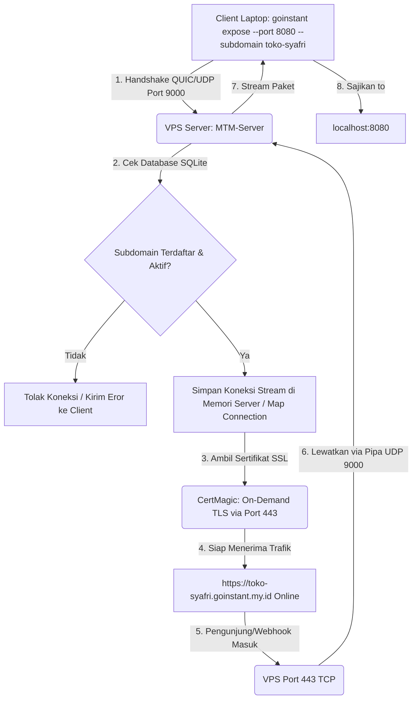
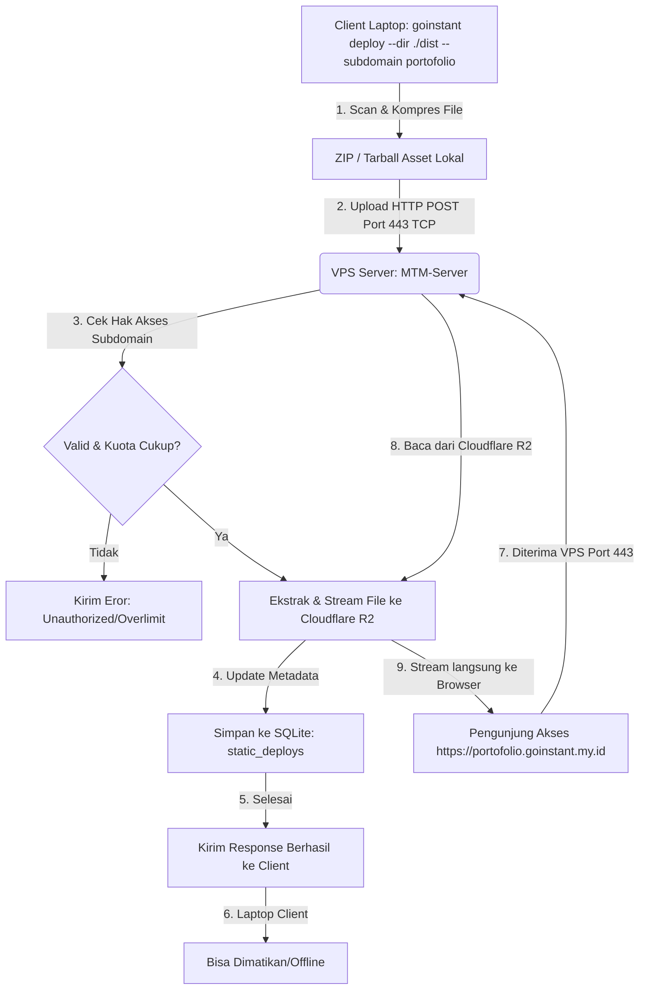
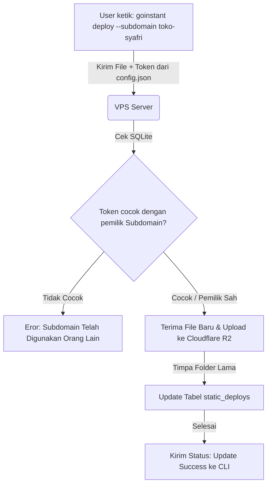

# Product Knowledge & Architecture Blueprint: goinstant.my.id

## 1. Vision & Core Value
`goinstant.my.id` adalah sebuah platform SaaS infrastruktur (Developer Tools) modern berbasis Go (Golang) yang merangkap dua fungsi utama:
- **Instant Tunneling (Ngrok-style)**: Mengekspos aplikasi localhost pengembang ke internet publik menggunakan protokol berkecepatan tinggi secara zero-config.
- **Instant Static Deployment (Netlify-style)**: Mengunggah dan meng-host file statis (HTML/CSS/JS) ke cloud global dalam hitungan detik.

**Prinsip Utama**: Klien/Pengguna akhir TIDAK BOLEH direpotkan untuk menginstal runtime language apa pun (seperti Go, Node.js, Python) di laptop mereka. Mereka cukup mengunduh satu file biner hasil kompilasi tunggal (Pre-compiled Single Binary) dari Go yang langsung bisa dieksekusi.

---

## 2. System Architecture & Network Flow
Infrastruktur jaringan berjalan di atas AWS EC2 (VPS) dan terintegrasi dengan Cloudflare R2. Port yang dibuka pada firewall AWS Security Group adalah **FINAL/SELESAI** dan tidak boleh ditambah:
- **Port 80 (TCP)**: HTTP Publik / ACME HTTP Challenge.
- **Port 443 (TCP)**: HTTPS Publik / Jalur Webhook, Web Traffic, dan Static Files.
- **Port 9000 (UDP)**: Core Tunneling Connection. Jalur pipa khusus berbasis protokol QUIC/UDP tempat CLI lokal terhubung ke VPS server.

### A. Alur Kerja Fitur `expose` (Tunneling)
1. Pengguna menjalankan perintah di terminal lokal:
   ```bash
   goinstant expose --port 8080 --subdomain toko-syafri
   ```
2. CLI lokal membuka koneksi persistent stream via **UDP Port 9000 (QUIC)** ke MTM-Server di VPS AWS.
3. VPS menangkap domain `toko-syafri.goinstant.my.id`. Melalui pustaka **CertMagic (Go)**, server langsung mengurus SSL otomatis secara real-time ke Let's Encrypt lewat **port 443**.
4. Publik mengakses `https://toko-syafri.goinstant.my.id` $\rightarrow$ VPS menerima trafik di **Port 443** $\rightarrow$ Diteruskan via pipa **UDP 9000** $\rightarrow$ Sampai di `localhost:8080` pengguna.

### B. Alur Kerja Fitur `deploy` (Web Static)
1. Pengguna menjalankan perintah di terminal lokal:
   ```bash
   goinstant deploy --dir "./dist" --subdomain portofolio
   ```
2. CLI lokal mengompresi dan mengunggah file statis via **HTTP POST** ke VPS (**Port 443 TCP**).
3. MTM-Server di VPS menerima file, lalu langsung melempar dan menyimpannya ke **Cloudflare R2 Object Storage** melalui API resmi.
4. Situs online selamanya di `https://portofolio.goinstant.my.id`. Saat diakses, server membaca dari R2 (Zero Egress Fee / Gratis Bandwidth). Laptop pengguna bisa dimatikan dengan aman.

---

## 3. Technical Specifications & Tech Stack
- **Backend Engine (Server & CLI)**: Go (Golang) murni.
- **SSL Automation**: Pustaka Go `github.com/caddyserver/certmagic` untuk On-Demand TLS di level kode server (Tanpa perlu biner Caddy terpisah, tanpa Certbot).
- **Network Protocol**: QUIC / WebSockets (Go-native) untuk menembus NAT/Firewall ISP rumahan klien.
- **Server Deployment**: Docker Container (`go-online-mtm-server`) berjalan di AWS EC2 Ubuntu.
- **Storage Provider**: Cloudflare R2 untuk efisiensi biaya penyimpanan static web asset.
- **Database Konfigurasi**: SQLite / Cloudflare D1 untuk menyimpan mapping subdomain pengguna secara instan.

---

## 4. Client Delivery & Packaging Policy
- **Cross-Compilation**: Dockerfile di VPS wajib melakukan cross-compile otomatis saat proses build server untuk menghasilkan biner 3 OS utama: `goinstant-windows.exe`, `goinstant-linux`, dan `goinstant-darwin`.
- **Distribution Mode**:
  - **Portable Mode**: Pengguna cukup mengunduh biner dan menjalankannya langsung di dalam folder proyek menggunakan perintah `.\goinstant.exe`.
  - **Global CLI Mode (Installer Script)**: Disediakan file `install.ps1` (Windows) dan `install.sh` (Linux/Mac) di rute `/downloads/` untuk otomatis mengunduh biner dan mendaftarkannya ke sistem PATH lingkungan pengguna. Setelah itu, pengguna bisa mengetik perintah bersih: `goinstant expose` atau `goinstant deploy` secara global tanpa embel-embel eksekusi file lokal.

---

## 5. Instruction for the AI Code Assistant
- **JANGAN** menyarankan penambahan port terbuka baru di AWS selain 80, 443, dan 9000 (UDP).
- **JANGAN** membuat konfigurasi yang mengharuskan klien lokal menginstal dependensi compiler pemrograman eksternal.
- Gunakan efisiensi konkurensi Go (*goroutines*) untuk menangani multiplexing koneksi hulu-hilir (Port 443 $\leftrightarrow$ Port 9000).
- Seluruh domain, routing, dan traffic handling wajib mengacu pada domain utama saat ini: `goinstant.my.id` dan wildcard-nya `*.goinstant.my.id`.
- **Ikuti arsitektur dan product knowledge ini dengan disiplin. Jangan keluar dari jalur ini.**

---

## 6. PRD Addendum: Database & Core System Logic

### A. Strategi & Manajemen Database (MTM-Server)
Untuk menjaga performa tinggi dengan konsumsi RAM yang sangat rendah di VPS AWS yang ramping, database utama untuk menyimpan data konfigurasi SaaS menggunakan SQLite (atau Cloudflare D1/PostgreSQL jika di-scale ke depan).

Database ini berjalan di sisi server VPS dan bertindak sebagai *Single Source of Truth* untuk mencocokkan rute trafik yang masuk dari port 443 ke tujuan akhir (apakah ke Pipa Tunnel atau ke Cloudflare R2).

#### Skema Database (DDL SQL untuk AI)
AI wajib mengikuti struktur tabel minimum berikut:

```sql
-- 1. Tabel Users (Manajemen Akun Developer)
CREATE TABLE IF NOT EXISTS users (
    id TEXT PRIMARY KEY, -- UUID / String ID
    email TEXT UNIQUE NOT NULL,
    plan_type TEXT DEFAULT 'free', -- free, pro, enterprise
    created_at DATETIME DEFAULT CURRENT_TIMESTAMP
);

-- 2. Tabel Subdomains (Mapping Rute Subdomain goinstant.my.id)
CREATE TABLE IF NOT EXISTS subdomains (
    id INTEGER PRIMARY KEY AUTOINCREMENT,
    user_id TEXT NOT NULL,
    subdomain TEXT UNIQUE NOT NULL, -- Contoh: 'toko-syafri' (artinya toko-syafri.goinstant.my.id)
    routing_type TEXT NOT NULL, -- 'tunnel' atau 'static'
    custom_domain TEXT UNIQUE, -- Contoh: 'toko-syafri.com' (jika ada)
    is_active INTEGER DEFAULT 1,
    created_at DATETIME DEFAULT CURRENT_TIMESTAMP,
    FOREIGN KEY(user_id) REFERENCES users(id)
);

-- 3. Tabel Static_Deploys (Metadata untuk Fitur Netlify-style)
CREATE TABLE IF NOT EXISTS static_deploys (
    id INTEGER PRIMARY KEY AUTOINCREMENT,
    subdomain_id INTEGER NOT NULL,
    r2_bucket_folder TEXT NOT NULL, -- Folder penampung di Cloudflare R2
    version_output TEXT NOT NULL, -- ID Commit / Versi Deploy
    deployed_at DATETIME DEFAULT CURRENT_TIMESTAMP,
    FOREIGN KEY(subdomain_id) REFERENCES subdomains(id)
);
```

### B. System Flowchart (Mermaid)

#### 1. Alur Proses `goinstant expose` (Tunneling)


#### 2. Alur Proses `goinstant deploy` (Web Static)


### C. Aturan Eksklusif Bagi AI Model (Instruction Prompt)
Ketika kode Go di server (`server.go`) dan kode CLI (`client.go`) dimodifikasi, AI wajib mematuhi batasan database berikut:
1. **In-Memory Routing Cache**: Untuk mempercepat pencarian rute trafik di port 443, jangan lakukan query database SQLite pada setiap request HTTP yang masuk. Gunakan Go `sync.Map` di dalam memori server sebagai cache rute aktif. Sinkronisasikan `sync.Map` ini dengan database SQLite setiap kali ada koneksi tunnel baru (`expose`) atau data baru yang terunggah (`deploy`).
2. **On-Demand TLS Validation**: Fungsi callback pada CertMagic (yaitu `OnDemandConfig`) wajib melakukan query ke tabel `subdomains` untuk memvalidasi apakah subdomain atau `custom_domain` yang meminta sertifikat SSL berstatus valid (`is_active = 1`). Jika tidak ada di database, gagalkan handshake TLS demi mencegah eksploitasi kuota Let's Encrypt oleh pihak asing.
3. **Pemisahan Logika Port**: Pastikan fungsi routing memisahkan penanganan antara domain tipe tunnel (diarahkan ke active channel port 9000) dan tipe static (diarahkan ke fungsi pembaca API Cloudflare R2).

---

## 7. PRD Addendum: Anonymous vs Authenticated User Flow

### A. Strategi Manajemen Akses (Anonymous & Registered)
Untuk membuat layanan ini viral, kita harus mengizinkan pengguna mencoba tanpa daftar. Namun, untuk mencegah penyalahgunaan (abuse) dan memicu pengguna untuk melakukan pembaruan data, kita pasang sistem Token.
- **Anonymous User (Tanpa Daftar)**: Bisa langsung `expose` atau `deploy`. Subdomain akan diacak oleh server (misal: `rand-1234.goinstant.my.id`). Token temporer akan disimpan di laptop mereka secara otomatis dalam file `~/.goinstant/config.json`.
- **Registered User (Daftar/Upgrade)**: Bisa memesan subdomain kustom yang statis (misal: `toko-syafri`), bisa menambahkan custom domain sendiri, dan memiliki kuota R2 yang lebih besar.

### B. Skema Database Tambahan (SQL for AI)
AI wajib menambahkan kolom token dan status pada tabel `users` untuk memvalidasi sesi dari CLI laptop:

```sql
-- Tambahkan kolom token dan is_anonymous jika belum ada
ALTER TABLE users ADD COLUMN token TEXT UNIQUE;
ALTER TABLE users ADD COLUMN is_anonymous INTEGER DEFAULT 1;
```

### C. Alur Logika & Cara Kerja (Flow untuk User)

#### 1. Cara Pengguna Mau Daftar (Sign Up / Upgrade)
Agar tidak perlu membuat halaman login dengan password yang ribet, gunakan metode Magic Link atau GitHub OAuth lewat browser yang dipicu langsung dari CLI.
1. Pengguna mengetik di laptop: `goinstant login`
2. **CLI Membuka Browser**: CLI Go akan otomatis membuka browser laptop pengguna ke halaman `https://goinstant.my.id/login?cli_session=xyz`.
3. **Daftar via Web**: Pengguna memasukkan email atau klik "Login with GitHub".
4. **Token Dikirim Balik**: Setelah sukses, web server VPS akan memperbarui tabel `users` (mengubah `is_anonymous` menjadi `0`) dan mengirimkan sebuah *Permanent API Token* kembali ke CLI. CLI menyimpannya di file `~/.goinstant/config.json`.

#### 2. Cara Update File Web Statis (`goinstant deploy`)
Ketika pengguna ingin memperbarui isi dari web statis mereka (misal mengubah kode HTML/CSS di folder lokal):
1. Pengguna mengetik ulang perintah di folder yang sama:
   ```bash
   goinstant deploy --dir ./dist --subdomain portofolio
   ```
2. **Validasi Token & Subdomain di VPS**:
   - CLI akan otomatis mengirimkan file beserta Token yang ada di laptop mereka (diambil dari `config.json`).
   - Server Go di VPS akan memeriksa database: "Apakah subdomain 'portofolio' ini milik pengguna dengan token ini?"
3. **Proses Timpa File di R2**:
   - Jika **YA**, server Go akan menerima file baru tersebut, mengunggahnya ke Cloudflare R2 pada folder subdomain yang sama (versioned), lalu memperbarui data di tabel `static_deploys`.
   - Jika **TIDAK** (misal orang lain mencoba membajak subdomain `portofolio`), server langsung menolak dengan error: `Error: Subdomain already taken by another user.`

#### 3. Cara Update Domain / Pindah dari Subdomain ke Custom Domain
Jika pengguna awalnya menggunakan `toko-syafri.goinstant.my.id` lalu ingin memperbaruinya menggunakan domain sendiri (`toko-syafri.com`):
1. Pengguna menambahkan via CLI atau Web Dashboard:
   ```bash
   goinstant domain add toko-syafri.com --subdomain toko-syafri
   ```
2. **Validasi Kepemilikan di Go Server**:
   - Server Go mengecek apakah pengguna tersebut adalah pemilik sah dari subdomain `toko-syafri` berdasarkan token mereka.
   - Jika sah, server akan memperbarui tabel `subdomains` pada kolom `custom_domain` menjadi `toko-syafri.com`.
3. **CertMagic Siap Beraksi**: Saat ada trafik masuk pertama kali ke `toko-syafri.com`, CertMagic di VPS langsung memicu On-Demand TLS karena datanya sudah sinkron di database SQLite.

### D. System Flowchart (Mermaid)

#### Alur Update / Deploy Ulang File Statis


### E. Instruksi untuk AI Code Assistant
- Setiap kali perintah `expose` atau `deploy` dijalankan tanpa menyertakan token registrasi (atau config lokal belum dibuat), sistem wajib membuat akun Anonymous otomatis di database SQLite dengan UUID acak, lalu memberikan token temporer tersebut kepada CLI untuk disimpan di `~/.goinstant/config.json`.
- Kunci keamanan autentikasi berada pada kecocokan antara token di tabel `users` dan kepemilikan baris data di tabel `subdomains`. Jangan pernah mengizinkan mutasi data (baik update file maupun update domain) jika token tidak cocok dengan pemilik data aslinya.

---

## 8. Stitching & Developer Suite Implementation Summary

We have fully integrated the custom developer console UI/UX mockups, built the backend APIs, enabled automated credentials config files, enforced strict subdomain ownership validations, and integrated the Paymenku payment gateway.

### A. Template Directory & Embed Structure
All 11 console pages are stored inside [server/templates](file:///d:/docker-server/go-online/server/templates) and embedded directly into the Go binary via `//go:embed templates/*` inside [dashboard.go](file:///d:/docker-server/go-online/server/dashboard.go):
- `landing.html`: Public Landing Page & Binary Downloads
- `login.html`: Authenticate and log in using your terminal API Token.
- `dashboard.html`: Live tunnel instances list, bandwidth charts, and interactive Pro Plan upgrade payment modal.
- `domains.html`: Dynamic DNS records viewer and custom domain binding interface.
- `webhooks.html`: Dynamic real-time webhook inspector logs stream and replay engine execution.
- `files.html`: Versioned static deployments rolled histories fetched directly from Cloudflare R2 bucket.
- `settings.html`: CLI tokens creator and credentials manager.
- `audit.html`: Security Audit Logs
- `analytics.html`: Traffic aggregate bandwidth graphs
- `status.html`: Latency, Uptime & health page
- `docs.html`: Dynamic interactive CLI documentation

### B. Core API & ServeMux Router
A central router registers all endpoints inside `RegisterDashboardRoutes(mux)`:
1. **Protected Page Router**: Check `goinstant_session` cookie. If not validated, redirect user to `/login`.
2. **Auth Endpoints**:
   - `/api/auth/login`: Verifies user API Token and returns a HTTPOnly cookie.
   - `/api/auth/logout`: Clears session cookies.
3. **Dynamic AJAX REST APIs**:
   - `/api/dashboard`: Aggregated metrics.
   - `/api/domains`: User subdomains list.
   - `/api/domains/add`: Bind CNAME custom domains (validated for ownership).
   - `/api/webhooks`: Captured tunnel traffic headers & bodies.
   - `/api/webhooks/replay`: Forwards historical webhook request streams over QUIC.
   - `/api/files`: R2 versioned static deployments list.
   - `/api/audit`: Action logging.
   - `/api/analytics`: Time-series graph dataset.
4. **Billing & Paymenku Payment Gateway integration**:
   - `/api/billing/upgrade` (POST): Generates a unique invoice reference (`INV-timestamp`), requests transaction creation on Paymenku API (`https://paymenku.com/api/v1/transaction/create`), saves the pending transaction, and returns the virtual account or QRIS payment link to the frontend.
   - `/webhook/payment` (POST): Receives callbacks when transactions change status. Validates payload integrity via HMAC-SHA256 signature checks using the configured Webhook Secret. Automatically upgrades successful buyers to the PRO plan in the SQLite database.

### C. Client Configuration & Token Auto-Save
- The client stores credentials at `~/.goinstant/config.json`.
- When running `expose` or `deploy` without a token, the server automatically registers a new Anonymous user, inserts a token UUID in SQLite, and returns it in the handshake response (or `X-GoInstant-Token` header).
- The client CLI intercepts this token and automatically saves it locally, ensuring immediate zero-config passwordless updates.

### D. Subdomain Ownership Enforcements
- **On Handshake (Expose)**: The server verifies if the subdomain is owned by another user before opening the QUIC gateway. If the subdomain is free, it binds it to the current user token on-demand.
- **On Deploy (Static)**: Server ensures the requester token matches the registered subdomain owner. If not, it rejects with `Subdomain already taken by another user` (HTTP 403).
- **Security Logs**: Actions are recorded under `audit_events` in the SQLite database.

